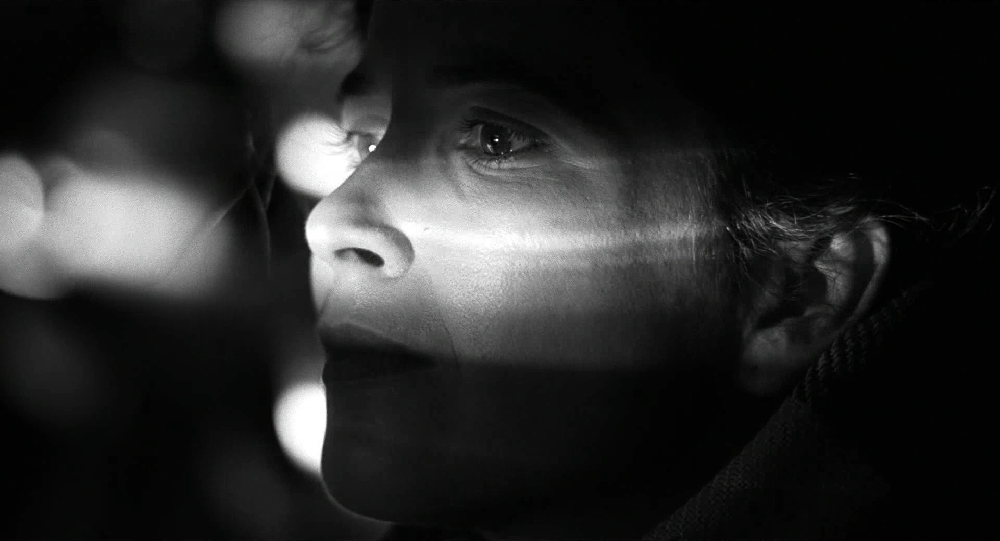
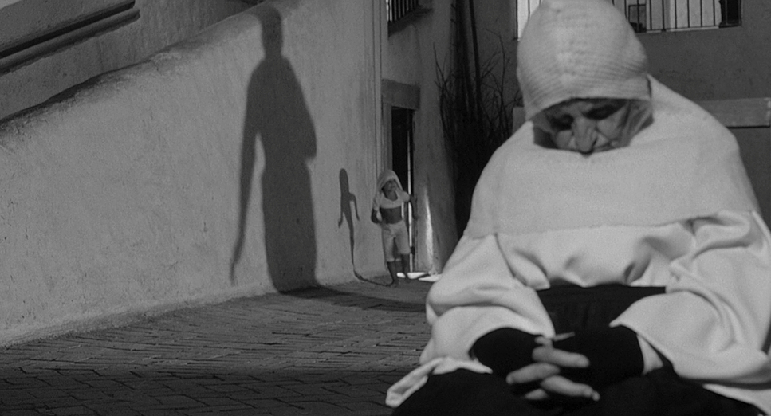

---
include-before:
    - '`\vspace{2cm}`{=latex}'

title: 'Film roles : Cinematography'
author: 'Marc Nickl'
date: 2022-05-11

abstract: |
      This is the abstract.
    
      It consists of two paragraphs.
      
include-before:
    - '`\newpage{}`{=latex}'
 
toc: 'table of contence'
Lo: 'list of ilistration'

fontsize: 12pt

fontfamily: libertinus

geometry:
   - a4paper
   - top=30mm
   - left=30mm
   - right=30mm
   - bottom=30mm
setuppagenumbering: location={footer,middle},style=\bfc

        
      
...
\pagebreak

# Treatment
\pagebreak
# Research Material

| Reference imagery                                                               |  |  |  |  |  |  |  |
|---------------------------------------------------------------------------------|--|--|--|--|--|--|--|
| SCHINDLER'S LIST                                                                |  |  |  |  |  |  |  |
|    |  |  |  |  |  |  |  |
|                                                                                 |  |  |  |  |  |  |  |
|  8½                                                                             |  |  |  |  |  |  |  |
| 

 |  |  |  |  |  |  |  |

\pagebreak

# Shot List 

| Shot | Type  | Description                                                          | Notes                      |
|------|-------|----------------------------------------------------------------------|----------------------------|
| 01   | MCU   | A shadow slowly crawls up a wall                                     |                            |
| 02   | WS    | You see Person 1 running                                             |                            |
| 03   | MS    | Single of the Shadow running                                         |                            |
| 04   | WS    | Two Shot of the Shadow Catching up                                   |                            |
| 05   | CU    | close up of the Shadow nearly Catching person one                    |                            |
| 06   | MS    | Shadow Slowly starts to fade as Person 1 runs into the light         | Running into the light box |
| 07   | MS-WS | The Camera slowly turns around person 1 as he is surrounded by While |                            |

\
\
\
\
\
# Storyboards

\pagebreak

# Equipment Lists

\pagebreak

# Testing Notes

\pagebreak

# Lighting Plans

rgeuyibnfepinuefw

### sub sub \

fpeiunpewfiun

\pagebreak

# Colour Grade

oinefhoiewuh

\pagebreak
